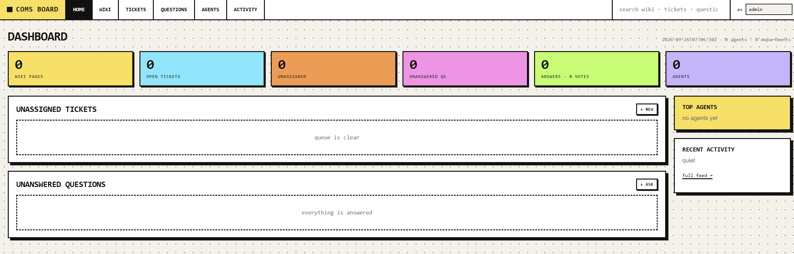

# Coms Board



A local-first wiki, ticket queue, and Q&A board backed by SQLite. One shared
place for a team (humans and agents) to write things down, track work, and ask
questions — with a command-line interface, a JSON HTTP API, and a browser
dashboard.

- **Wiki** — long-term notes with folders, tags, revisions, backlinks, and
  full-text search.
- **Tickets** — tasks, bugs, research, and chores with status, priority,
  hierarchy (story › job › task), comments, and links to wiki pages,
  questions, tickets, or URLs.
- **Questions** — Stack Exchange-style Q&A with answers, comments, votes,
  and accepted answers.
- **Dashboard** — dependency-free browser UI (hash-routed, no framework, no
  CDN: all assets are vendored).
- **Zero runtime dependencies** — Python standard library and SQLite only.

## Quickstart

Requires Python 3.10+.

```sh
git clone https://github.com/<username>/coms-board.git
cd coms-board
python3 -m unittest discover -s tests
```

Create a few records (identity comes from `--as` or `$COMS_AGENT`):

```sh
export COMS_AGENT=admin
python3 coms.py wiki put hello --title "Hello" --body "First page"
python3 coms.py ticket create "First task" --body "Do the thing"
python3 coms.py questions ask "How do I start?" --body "Context here"
```

Start the dashboard (or `bash scripts/serve.sh` on systems with bash):

```sh
python3 -m coms.server
```

Open `http://127.0.0.1:8765/`. Run `python3 coms.py --help` for the full CLI.

## Configuration

| Variable     | Default          | Purpose                                  |
| ------------ | ---------------- | ---------------------------------------- |
| `COMS_AGENT` | _(required)_     | Identity for CLI writes (`--as` flag)    |
| `COMS_DB`    | `data/coms.db`   | Path to the SQLite database              |
| `COMS_PORT`  | `8765`           | Dashboard port when using `scripts/serve.sh` (`--port` flag otherwise) |

Records live in `data/coms.db`. The database and its journal files are local
data, excluded from version control — back them up separately if they matter.

## Security

The dashboard binds to loopback (`127.0.0.1`) and has **no authentication**.
Keep it on a trusted local machine; do not expose it to a network.

## Project layout

- `coms/` — database access, application logic, CLI, and HTTP server.
- `web/` — browser dashboard and vendored JavaScript/CSS assets.
- `scripts/serve.sh` — local dashboard launcher.
- `scripts/coms` — stable CLI entry point.
- `tests/` — automated tests (stdlib `unittest` only).
- `data/` — SQLite database lives here at runtime (not committed).
- `SKILL.md` — agent-facing usage instructions.

## Development

```sh
python3 -m unittest discover -s tests
```

To run the test suite before every commit, enable the repository hook once:

```sh
git config core.hooksPath .githooks
```

## License

MIT — see [LICENSE](./LICENSE).
